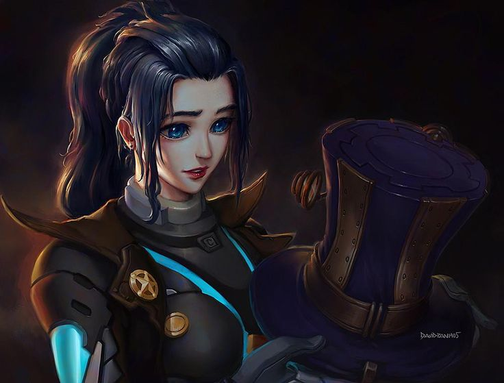

# Avanzado

Como sabemos, Markdown es compatible con HTML, es decir que si colocas código en HTML se representará normalmente, es por esto que en esta última parte veremos algunos formatos que se pueden añadir con HTML dentro de Markdown.

## Underline (Subrayado)

Lo primero que veremos es el subrayado de texto, el cuál no es muy común, pues es usado para links u otras cosas. Se usa con dos etiquetas HTML <ins>

<ins>Texto Subarayado con dos Etiquetas<ins>

## Center (Centrado)

Se puede centrar el texto no solo en tablas con dos etiquetas HTML "<center\>", la etiqueta del final debe tener una barra inclinada para cerrar el texto centrado.

Este texto es centrado.

## Color

También se puede colorear los textos con HTML, usando la etiqueta font color = "Color", con esto se puede colocar colores comunes con el nombre de los mismos. También se puede usar la etiqueta <p\> como se puede ver más abajo.

Este Texto es Amarillo.

Este Texto es Rosado.

## Admonitions (Advertencias)

Esto se refiere más a un tipo especial de BlockQuote, en el cual se coloca un emoji, más el tipo de Advertencia en negrita y su descripción. Es un formato estándar para dar advertencias o plasmar sugerencias.

> :warning: **Warning**: Esto es una Advertencia de Peligro

> :memo: **Note**: Esto es una Nota de Información

## Image Size (Tamaño de Imagen)

Se puede modificar el tamaño de las imágenes que insertemos de dentro de Markdown, para esto usamos la etiqueta  y sus propiedades Width y Height. Como se puede ver también se pueden centrar imágenes con la etiqueta antes vista.

## Image Captions (Título de Imagen)

Tambíen es posible colocar títulos debajo de las imágenes, que expliquen qué se está viendo, para esto usamos la etiqueta <figure\> y la etiqueta <figcaption\>, en donde colocamos el título de la imagen.

<figure>
    

        
        <figcaption>Título de la Imagen Caitlyn.</figcaption>
    

</figure>

## Symbols (Símbolos)

HTML también te permite ingresar unos ciertos símbolos que son usados algunas veces, para estos debemos usar el carácter "&#" seguido de el texto especial para formar el carácter y al final un punto y coma. Los carácteres especiales son:; Copyright:  &copy;; Registered trademark: &reg;; Trademark: &trade;; Euro: &euro;; Left arrow:  &larr;; Up arrow: &uarr;; Right arrow: &rarr;; Down arrow: &darr;; Degree: &#176;; Pi: &#960;; Arroba: &#64;.

## Table Formating (Formato de Tablas)

Dentro de las Tablas que ya hemos visto tambíen se puede realizar distintos formatos, pero para esto es necesario usar HTML. Por ejemplo se puede colocar saltos de línea con la etiqueta <br\>.

| Syntax      | Description |
| :---------: | :---------: |
| Header      | Título |
| Párrafo   | Primer párrafo.    Segundo párrafo.|

Otra cosa que se puede hacer es colocar listas dentro de las Tablas, para esto usamos la etiqueta <ul\> y <li\> dentro del elemento que queremos que sea una lista y colocamos los items entre etiquetas <li\>.

| Syntax      | Description |
| :---------: | :---------: |
| Header      | Título |
| Lista       | Aquí hay una lista en una tabla <ul><li>Primer item.</li><li>Segundo item.</li></ul> |

## HTML Headings

Para colocar Heading con HTML usamos las etiquetas <h1\> hasta la <h6\>, esto nos servirá para las siguientes partes que vermos a continuación.

<h2 id="1">Heading IDs (Links de Títulos)</h2>

Lo anterior es la forma de colocar los Heading en HTML, pero ahora veremos como crear links hacia los títulos de nuestro trabajo, para esto colocamos el id dentro de la etiqueta <h2\> y luego para referenciarla usamos la etiqueta <a\> y su propiedad "href"..

<a href="#1">Hacia Heading IDs</a>

<h2 id="2">Table of Contents (Tabla de Contenidos)</h2>

Con lo anterior ya sabido podemos crear una Tabla de Contenidos con una lista y en cada elemento una referencia hacia un Heading para que podamos desplazarnos por el documento con mayor rapidez.

* <a href="#1">Hacia Heading IDs</a>
* <a href="#2">Hacia Table of Contents</a>

## Videos

Si bien no se puede colocar videos dentro de Markdown, si se puede crear imágenes con links a videos como se puede apreciar a continuación, se coloca una imagen y el link hacia un video de Youtube.

