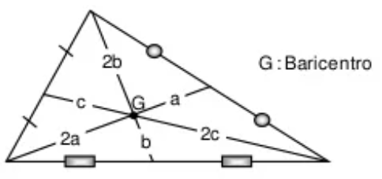
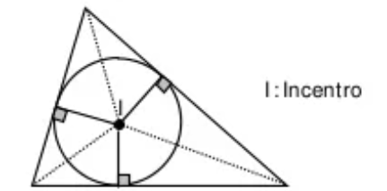
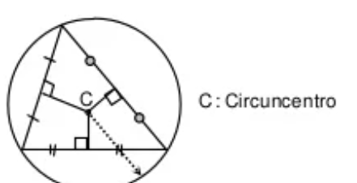
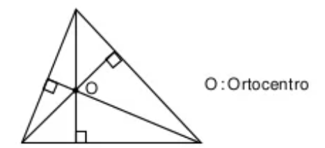
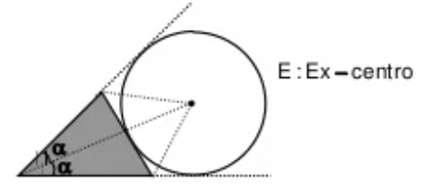

# Lineas Notables :triangular_ruler:

Al trabajar con **Triángulos** tenemos una serie de líneas notables que pueden estar tanto dentro como fuera de los mismos y generar ciertas condiciones especiales en ángulos, lados, etc. A continuación, veremos las principales:bulb::

<h3 id = 1> 1. Mediana  </h3>  

  

<h3 id = 2> 2. Bisctriz Interior</h3>  

<h3 id = 3> 3. Mediatriz</h3>  

  

<h3 id = 4> 4. Altura</h3>  

  

<h3 id = 5> 5. Bisectriz Exterior</h3>  

  

### <ins>Comparación de Líneas Notables</ins>

|Linea Notable|Descripción|Punto Notable|
|:---:|:--:|:--:|
|<a href = #1> Mediana </a>|<li>Parte al lado opuesto a la mitad <li>Las medianas se cortan en relación de 1 a 2||
|<a href = #1> Bisectriz Interior </a>|<li> Divide al ángulo a la mitad <li>El corte de los 3 es el centro de un círculo interno||
|<a href = #1> Mediatriz </a>|<li> Divide al lado a la mitad formando un ángulo recto <li> El corte de las 3 es el centro de el círculo que inscribe al triángulo||
|<a href = #1> Altura </a>|<li> Genera un ángulo recto <li> El corte genera el llamado ortocentro||
|<a href = #1> Bisectriz Exterior </a>|<li> Divide un ángulo externo a la mitad <li> El corte de las 3 es el centro de un círculo exinscrito.||
