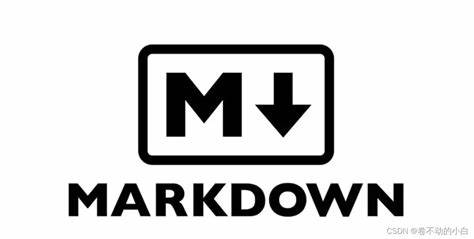

# ✏️ Markdown ✏️

Bienvenido al primer proyecto de **Markdown**. En este veremos la importancia del documento README.md, además de realizar el nuestro del proyecto en el que estamos; por esta razón trataremos de usar todo lo aprendido en los tres documentos que hemos realizado.  
**Así que, ¡comenzemos!**

### :thinking: ¿Qúe es el documento README.md?

Es un documento que sirve para describir cómo funciona el proyecto, que documentos podemos encontrar, para qué se usa cada documento, etc. En Github además es el primer documento que otros ven cuando revisan un proyecto que estás realizando, por lo que siempre es bueno que tenga información relevante.

### :teacher: Proyecto Markdown

Este primer proyecto realizado por mi parte sirve para apuntar todo lo aprendido sobre **Markdown**, además de ser el primero en utilizar **Git**. Dentro de este también se pueden ver proyectos simples, todo con el fin de conocer a fondo este lenguaje de escritura y usarlo más adelante.

Toda la información del proyecto fué obtenida de la guía oficial de Markdown, a la cual se puede acceder a continuación.

[Link Guia Markdown](https://www.markdownguide.org/)

### :white_check_mark: ¿Que contiene este proyecto?

A continuación veremos una descripción detallada de los 3 documentos principales de aprendizaje que he desarrollado:

> ### 1. Básico :smile:
> Contiene los formatos básicos de Markdown, negrita, itálica además de elementos simples como Listas o imágenes.

>### 2. Intermedio :neutral_face:
> Contiene elementos más complicados como tablas, emojis u demás formas de ingresar código, elementos comunes dentro de documentación pero algo más difíciles de implementar.

>### 3. Avanzado :cry:
> Contiene formatos que solo se pueden hacer con etiquetas HTML, debido a que Markdown si lo soporta, además de métodos avanzados dentro de tablas, headings entre otras cosas.

Además de estos, se tendrá una carpeta llamada Proyectos, en donde se colocarán los proyectos que realizaré con Markdwon; y varias carpetas de elementos como imágenes, links u otras cosas que pueden servir para Proyectos futuros.